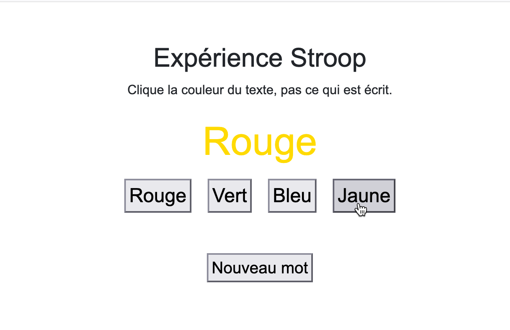

<!-- lang: fr -->

# Stroop

Ce dépôt contient un code minimaliste permettant de reproduire l'expérience classique attestant de l'[*effet de Stroop*](https://fr.wikipedia.org/wiki/Effet_Stroop) mise au point par son auteur. Voir son article:

[Stroop, J. R. (1935). Studies of interference in serial verbal reactions. Journal of experimental psychology, 18(6), 643.](https://pure.mpg.de/rest/items/item_2389918/component/file_2389917/content)

L'expérience classique soumet de manière répétée un utilisateur à un stimulus : un mot et une couleur (d'encre utilisée pour afficher le mot). La tâche de l'utilisateur consiste à indiquer la couleur utilisée pour afficher le mot.

Les stimuli peuvent être *congruents* (le mot affiché est celui de la couleur utilisée pour l'afficher) ou *incongruents* (le mot indique une couleur différente de celle utilisée pour l'afficher).

---

---

Cette expérience doit montrer que :([repris de Wikipédia](https://fr.wikipedia.org/wiki/Effet_Stroop))
"... *le temps de réaction — en d'autres termes le temps nécessaire à la dénomination de la couleur avec laquelle le mot est écrit — est beaucoup plus long lorsque le mot est incongruent (le mot « bleu » écrit en rouge) que lorsque le mot est congruent (le mot « rouge » écrit en rouge) ou neutre (le mot « lion » écrit en rouge).*

*Le pourcentage d'erreurs (dire bleu lorsque le mot « bleu » est écrit en rouge) est également plus élevé en présence des mots incongruents. Il existe donc un effet d'interférence sémantique, ou effet Stroop, provoqué par la lecture automatique du mot.*
"
