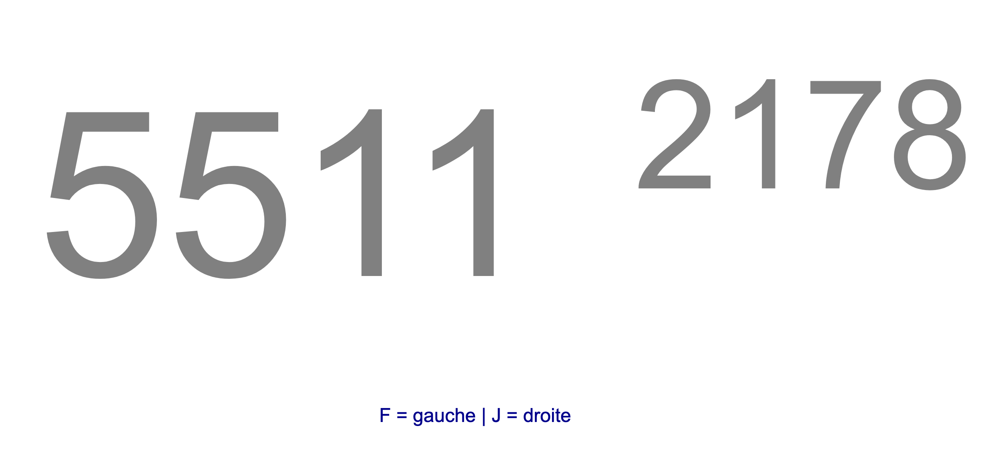

<!-- lang: fr -->

# Stroop

Ce dépôt contient un code minimaliste permettant de reproduire l'expérience classique attestant de l'[*effet de Stroop*](https://fr.wikipedia.org/wiki/Effet_Stroop) dans une variante qui mérite d'être examinée.

L'expérience soumet de manière répétée un utilisateur à un stimulus : deux nombres sont affichés à l'écran, uitlisant des tailles de police différentes (l'un d'eux est plus "grand" en taille). La tâche de l'utilisateur consiste à indiquer si le nombre le plus grand (en magnitude) en tapant un touche au clavier: "F" si le nombre le plus grand est à gauche, "J" sinon.

Les stimuli peuvent être *congruents* (le nombre affiché avec la police de plus grande taille est effectivement le plus des deux) ou *incongruents* (le mot affiché en "plus grand" est plus petit).

---

---

Cette expérience doit montrer que :([adapté de Wikipédia](https://fr.wikipedia.org/wiki/Effet_Stroop))
"... *le temps de réaction — en d'autres termes le temps nécessaire à indiquer lequel des nombres est le plus grand (en magnitude) — est beaucoup plus long lorsque les stimuli sont incongruents que lorsqu'ils sont congruents.*

*Le pourcentage d'erreurs est également plus élevé en présence des stimuli incongruents. Il existe donc un effet d'interférence sémantique, ou effet Stroop, provoqué par la taille d'affichage des nombres.*
"

P.S. Cette variante pourrait toutefois exiger de nuancer la conclusion, on pourrait penser que le conflit entre système 1 et système 2 (de Kahneman) que soulève l'expérience de Stroop est ici moins prononcé (comment en faire le onctsta ?). C'est l'un des intérêts de cette variante.
